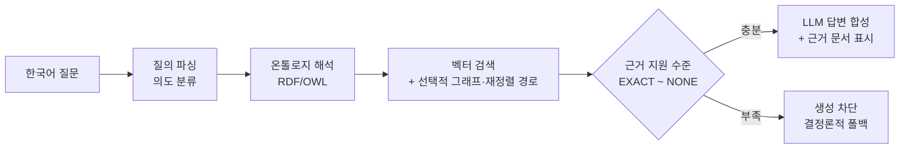

  <b>폐쇄망 RAG 시스템을 설계하고, 코딩 에이전트 주도 개발과 자동 검증으로 완성까지 책임지는 개발자</b> 
  Closed-network RAG systems — designed by me, built with coding agents, proven by automated verification.

  
  
  
  
  
  
  
  
  
  

---

## 🔒 무엇을 만드나

방산·IPS 기업 재직 (2024.04~). **외부망이 차단된 환경**이 기본 전제입니다.
인터넷 없는 현장 태블릿에서 정비교범(S1000D)에 질문하면, 근거 문서와 함께 답이 나오는 시스템을 만듭니다.
설계와 검증 기준은 직접 잡고, 구현은 코딩 에이전트를 지휘하며, 결과는 자동 QA 루프로 증명합니다.

## 📊 검증 범위와 작업 규모

| **실기기 핵심 흐름 확인** | **100문항 × 5주기** | **핵심 RAG 흐름 오프라인** | **단독 설계·구축** |
|:---:|:---:|:---:|:---:|
| Android에서 검색→답변→근거 표시 핵심 흐름 확인 | 총 500회 자동 검사 통과 사람의 답변 품질 평가 아님 ([검증 리포트](https://github.com/Han43seong/S1000D-RAG/blob/main/docs/rag_quality_evidence_report.md)) | 로컬 PC 파이프라인과 Android 핵심 RAG 경로 | 개발·배포 자동화 체계 5~10명 개발팀 사용 |

## 🧭 파이프라인 한눈에

근거가 부족하면 **답을 지어내는 대신 차단**합니다 — 정비 도메인에서 지어낸 절차는 안전 문제이기 때문입니다.

## 📦 대표 프로젝트

| 프로젝트 | 무엇 | 증거 |
|---|---|---|
| [**S1000D-RAG**](https://github.com/Han43seong/S1000D-RAG) | S1000D 구조 메타데이터를 보존하는 폐쇄망 RAG 프로토타입 — 근거 부족 시 생성 차단 경로 구성 | [자동 QA·회귀 검증 리포트](https://github.com/Han43seong/S1000D-RAG/blob/main/docs/rag_quality_evidence_report.md) |
| [**S1000D-RAG-Android**](https://github.com/Han43seong/S1000D-RAG-Android) | ONNX int8 임베딩 + llama.cpp NDK — Android 실기기에서 오프라인 검색→답변→근거 표시 핵심 흐름 확인 | [빌드·배포 가이드](https://github.com/Han43seong/S1000D-RAG-Android/blob/main/BUILD_GUIDE.md) |
| [**just-chill**](https://github.com/Han43seong/just-chill) | 코딩 에이전트의 "완료" 보고를 근거(변경 내역·테스트 결과)로 검증하는 정책 레이어 | [검증 스크립트 체계](https://github.com/Han43seong/just-chill/tree/main/scripts) |

## 🔁 일하는 방식

1. **표준 패턴으로 빠르게 시작한다** — v1은 순수 벡터 RAG였습니다
2. **계측으로 원인을 분리한다** — 추적 결과, 검색은 정답인데 답변이 깨지고 있었습니다
3. **땜질의 한계를 인정하고 구조를 재설계한다** — 가드 패치 대신 온톨로지 중심 아키텍처로
4. **자동 검증으로 고정하고, 실패도 기록한다** — [v1 실패 분석](https://github.com/Han43seong/S1000D-RAG/blob/main/docs/retrospectives/rag-v1-failure-analysis.md) → [v4 재설계 회고](https://github.com/Han43seong/S1000D-RAG/blob/main/docs/retrospectives/rag-evolution-v1-to-v4.md)

**개발 방식** — Claude Code·Codex·Gemini 멀티모델 오케스트레이션 + 자동 검증 하네스. 완료는 로그가 아니라 테스트 결과로 판단합니다.

---

📫 <a href="mailto:han43seong@gmail.com">han43seong@gmail.com</a>

